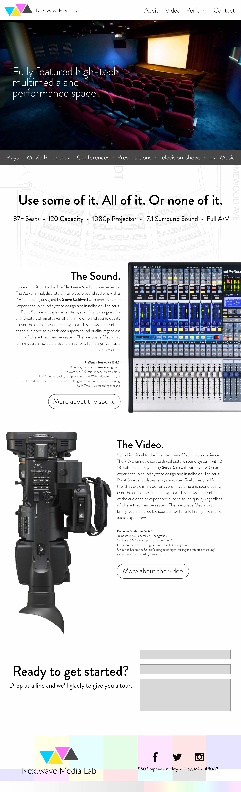

# Nextwave Media Lab

## Summary

Nextwave Media Lab was an odd amalgamation of live production venue and accelerator think tank. It was a group of creatives who were offered space to be artists within a corporate building that happened to have a small theater inside of it.&#x20;

In 2012-ish, Nextwave Media Lab brought me on as their video lead to replace the outgoing person. It was a good fit as I knew many of the people who worked there and was able to mesh well with the team.&#x20;

As I was coming in, the sound engineer Steve Caldwell was finalizing major renovations to the audio capabilities of the space and I immediately took the opportunity to modernize the video components as well. The previous toolset was aging quickly or poorly chosen and becoming unreliable for the clientele we wanted to attract.

Over the course of a few years we had all types of events in the space from corporate executive talks, to live music production, to plays, to motivational speakers. NWML wasn't just the venue though, many of us spent our time innovating new ideas and refining our crafts in other ways while not working events. Some of these endeavors were picked up by parent company Nextwave and its sister company Silkroute Global.

## Website

I mocked up several website designs for NWML over the years and was able to put one of them into production. Here is one mockup example from my archive:

<figure><figcaption></figcaption></figure>
