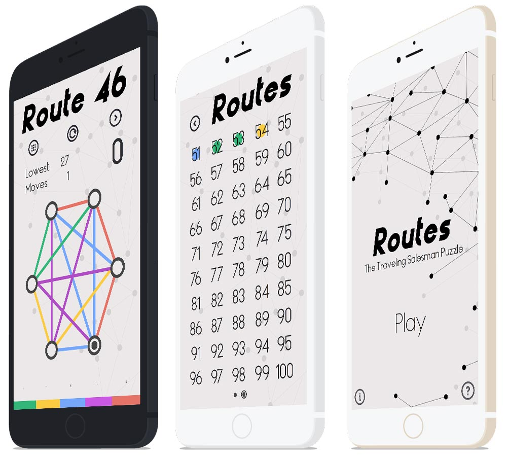

# Routes  🚀

`2014 - Lead UI Designer / Art Director`

`Client: Nextwave`&#x20;

<figure><figcaption></figcaption></figure>

## History

The team at Silkroute originally set out to build Routes as a hybrid mobile application on top of the PhoneGap framework. Our team has had vast experience with building interfaces with web technologies, but never before a game that could require higher framerates. After much testing, it was determined that building Routes native would be the way to go.

<figure><figcaption></figcaption></figure>

Inspired by the golden ages view of the future, I took a flat design approach with a twist in the initial concepts that were originally destined for a hybrid application. The photography is directly from NASA and the typography was researched heavily and licensed from Creative Market. I experimented with various design elements for this version, but felt very comfortable with the stained white color on top of the imagery.

