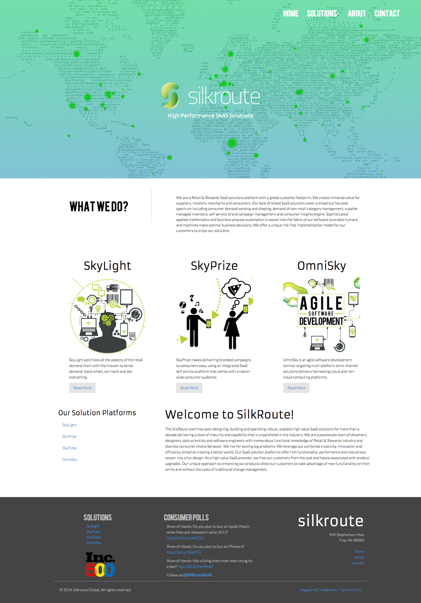
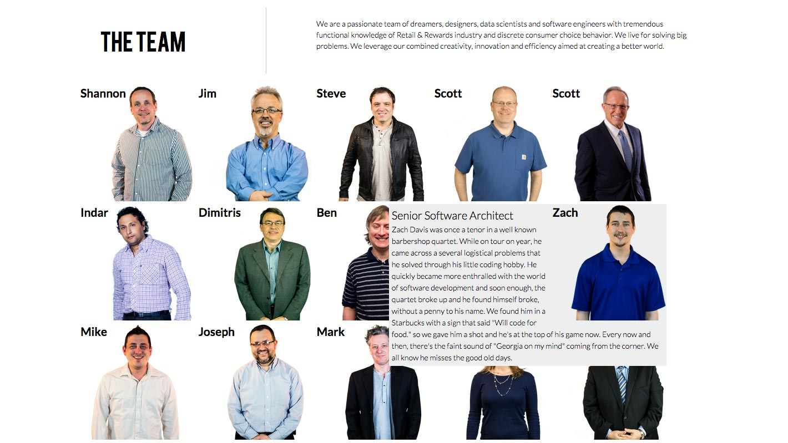
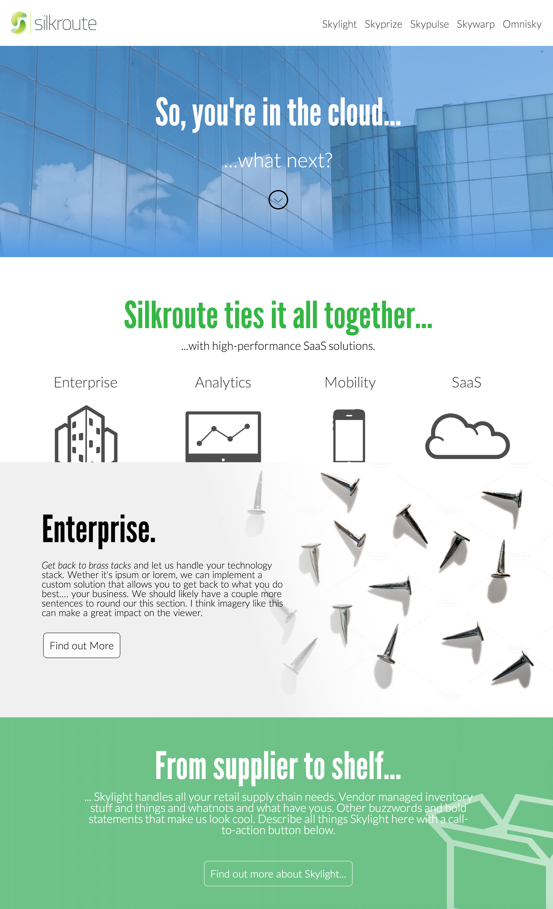

# Silkroute Global

`2012 - 2015 - Design Lead \ Web Development \ Video Producer \ Animator`

## Website

<figure><figcaption>
Home page of Silkroute Global from 2013 to 2015
</figcaption></figure>

<figure><figcaption>
About page with a CMS backed list of team members. Photos have transparency and dynamic popover.
</figcaption></figure>

<figure><figcaption>
A concept to refresh the Silkroute website
</figcaption></figure>

<figure><figcaption>
The team listing randomly shuffles green-screened portraits - anyone who didn't submit a bio had one written on their behalf
</figcaption></figure>

## Print Assets

<figure><figcaption>
A folder for an event based on our internal design language
</figcaption></figure>

## Corporate Video / Advertisement

`2013 - Director/Animator/Designer/Editor`

Silkroute had a very large set of visual assets to represent the company's presence amongst myriad markets. Some were created or obtained before I came on board and I filled in the gaps as I refreshed how it all came together.&#x20;

Having such a vast visual library allowed me a great opportunity to animate an engaging introduction video for sharing with potential clients and partners. Motion graphics were processed in After Effects from vector images made in Illustrator.&#x20;


