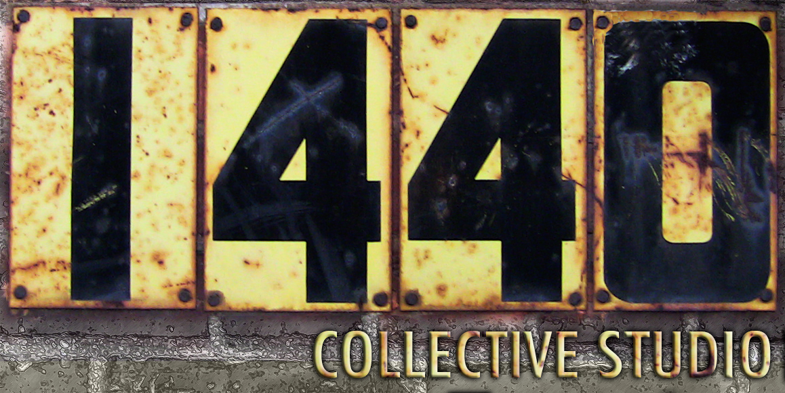

# Logos


I'm building this page on the fly with assets that I have on hand. There are a few logos in here that are better suited for light backgrounds. I'll update them as I have time, but would prefer putting up what I have as a placeholder until then or I'll never do it.


## Client Logos

.png>)

## Personal Logos

Queird was the extension of a previous project I felt fell short. It was supposed to be a queer marketplace for artists and makers with the goal of obtaining and maintaining a makerspace for them to use to make their wares. The idea was unfortunately put aside indefinitely as I focused on my work with VDBX, but I hope to bring it back as a non-profit incubator and makerspace for queer artists. The focus will be a bit different and cater towards homeless or transient queers who live in vehicles.&#x20;

An early logo for my personal work showing a stylized set of CMYK swatches invoking registration marks and also video color bars.

The 1440 Collective was a local underground music venue and music studio in Detroit. It consisted of a group of like minded artists collaborating to make music and all types of art surrounding it.

&#x20;

I started using this logo when I began designing circut boards. You can see it on many of my designs and on packaging for VDBX.io products that I design.

<figure><figcaption></figcaption></figure>

An alternate branding of my full name that can be used in conjunction with the previous "@clomads" logo.

<figure><figcaption></figcaption></figure>

Agnostic Lab was a stop-gap branding I chose when transitioning my creative career from video production to UI design.

<figure><figcaption></figcaption></figure>

An early concept branding devised as a holding company for Queird, VDBX.io, and my personal branding.

<figure><figcaption></figcaption></figure>

OP1N was a parent organization for a few projects built by Chloe Madison and Joe Piemeisel. This site is actually still up and I have the domain op1n.com - I might still do something with it as it still fits with my ethos.

## Deep Cuts

These are extremely old and show my progression as a designer since my early days learning how to use Photoshop.

<figure><figcaption></figcaption></figure>

Slickfire Productions was my first brand representing the creative work I did in middle school, high school and even into my early 20s.&#x20;

<figure><figcaption></figcaption></figure>

Bamboozled was my best friend Paul's high school band and I acted almost as a media consultant, creating this logo and other visual media to help promote them.

<figure><figcaption></figcaption></figure>

A filmmaker friend of mine in high-school gave me the prompt for this logo but decided on a different name.
