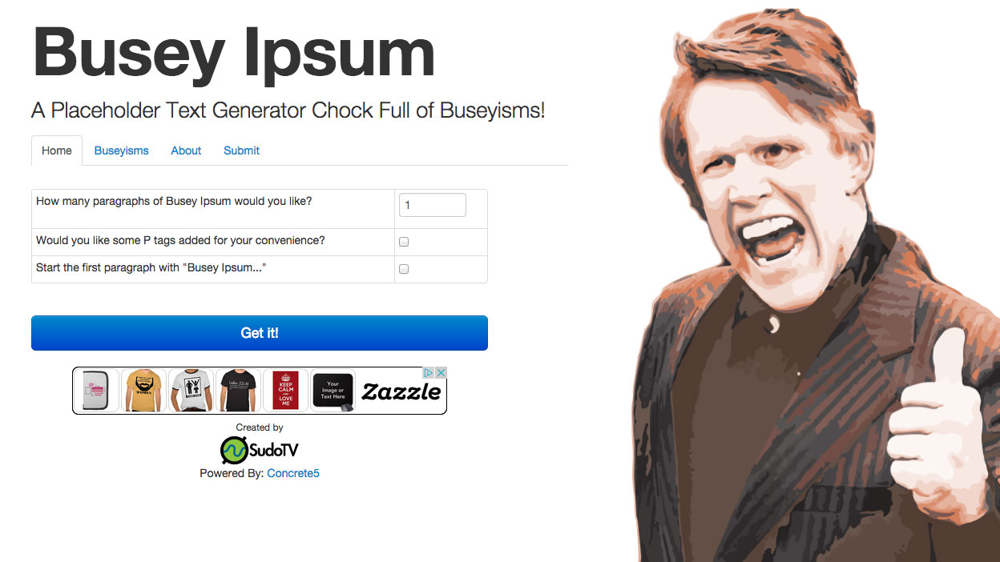

# Busey Ipsum

`2012 & 2017 - Web Developement & Design`

Around 2011/2012, it was popular in web design circles to create silly Ipsum generators. This was around the time I started taking web development seriously, so as an exercise I created Busey Ipsum based on the CMS I was working with at the time Concrete5. It creates filler text based on Gary Busey quotes.&#x20;

Unfortunately it was PHP and way too heavy for what it was, so in around 2017 I rewrote the whole thing as a static page with the functionality in Javascript, while taking the time to modernize the design.

&#x20;It still currently resides at [buseyipsum.com](http://www.buseyipsum.com) and is hosted by Github pages.&#x20;

## History

<figure><figcaption>
First version of buseyipsum.com
</figcaption></figure>
