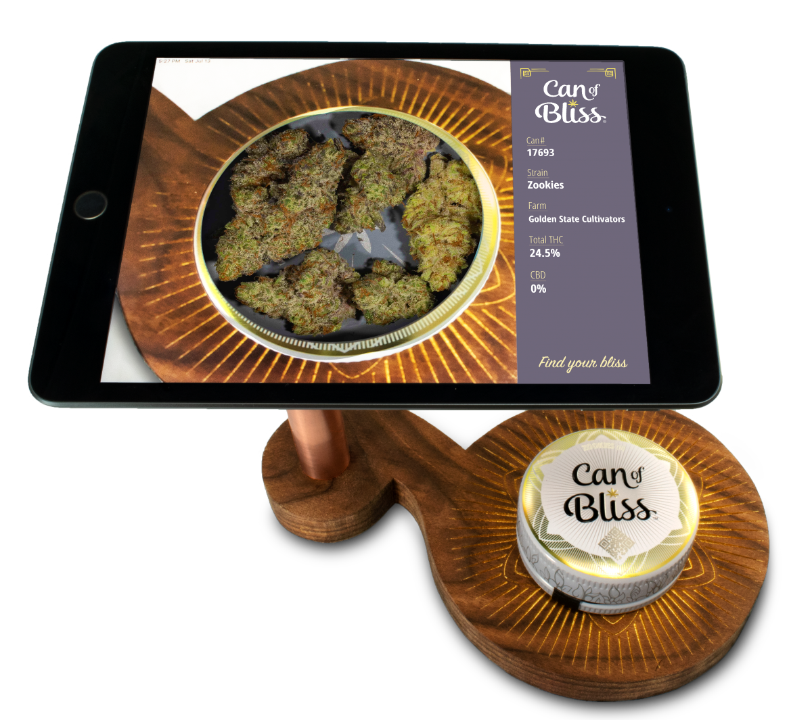

# Can of Bliss

`2019 - Freelance Design Consulting & Production`

<figure><figcaption>
Pre-production design of the store unit
</figcaption></figure>

## Summary

In 2019 I was asked to help with design and production of a customer facing interactive experience that cannabis brand Can of Bliss was working on at the time. Each can had a unique QR code that allowed an app to generate an augmented experience so that you can "see" inside each can sold. It was thought that having a dedicated display with an iPad running the app in dispensaries would help customers understand the concept so that they  would download the app and use it themselves.&#x20;

## Design & Manufacturing

A concept design was presented to me on my first meeting with the team and I immediately got to work refining it and making sure it fit within the brand. Luckily I had the help of the in-house designer to help manage brand assets and finalize production files as we moved closer to doing a production run.

This project ended up using all of my manufacturing and design skills from CNC machining the walnut base to lasering the artwork on top and even holding the iPad mini with a custom 3D printed part.

* CNC routed walnut base
  * Laser etched design with gold leaf paint
  * Finished with boiled linseed oil
* Copper water pipe - polished
  * 3D printed cap fits to iPad with VHB tape

Unfortunately, after a short production run, Can of Bliss lost its investment runway.
