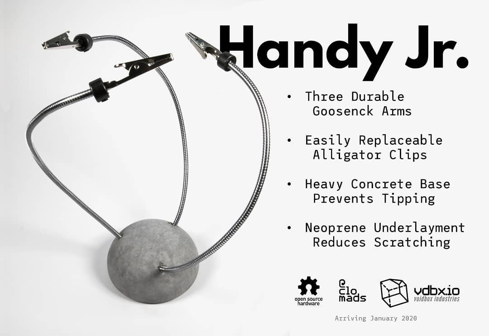

# Voidbox Industries

## [VDBX.io](https://vdbx.io) ↗&#x20;

## Summary

Voidbox Industries sprang out of a need to keep my mind busy after losing my last tech job and having trouble finding a new one. I started learning more intricate electronics and mixed that with other maker skills such as woodworking and mold making. I eventually settled on making concrete knicknacks with a brutalist aesthetic by creating custom molds out of my 3D printed designs.

Conceptual designs had the electronics and concrete work meeting in the middle, but then COVID hit and everything changed, forcing me to focus more on the electronics side of things. While we were in the thick of COVID, I ended up trading the tiny van I lived in for a shorty school bus that I wired up with solar and lithium batteries.

Years earlier I had developed an interest in the open-source Home Assistant project, but never had the time or space to really dive in, until the bus, but it brought its own challenges due to most IOT devices assuming you're living in a house with AC wiring. This is where the pivot for VDBX started happening, tho life made it so it was just research for the next couple years.

VDBX relaunched in 2023 with a focus on Home Assistant focused hardware for off-grid installations. Coming into 2025, I have a healthy start to a microcontroller platform and a Crowd Supply coming soon.  I hope that within a year or two I can hire my friends to help with production and turn it into a worker-owned co-op. Within the theme of automation, I hope to also document our local manufacturing / QA / packaging operations for all to benefit from.&#x20;

## Brand

The name Voidbox came from a concrptual design I had in my head for lamps created with Vantablack alternatives so that the viewer would be confused about the source of light. At the time only Stuart Semple's Black 2.0 was available and didn't create the effect I was hoping for. I have yet to try with Black 3.0 and fuck Anish Kapoor.

I eventually broke down Voidbox to VDBX while doing a domain search and found that VDBX.io was available. It wasn't until a little while later that I realized that I & O are the vowels removed from Voidbox to make VDBX.

The cube logo came from an 3D model I made as an enclosure that had one corner cut to allow that to be its primary base. I converted it to a CAD drawing and imported the vectors into Affinity Designer. From there I noticed that playing with the line weight created a unique visual glitch that made the viewer misread the proper orientation of the cube.

All of this was made on a whim in 2018 when I first started and I still feel affinity with the brand, but in 2023+ it may be time for a slight refresh to the assets.&#x20;

## History

I used to make conrete products under the VDBX.io brand but things changed when the pandemic hit. Here's a few items we designed and or sold at that time.&#x20;

<figure><figcaption></figcaption></figure>

