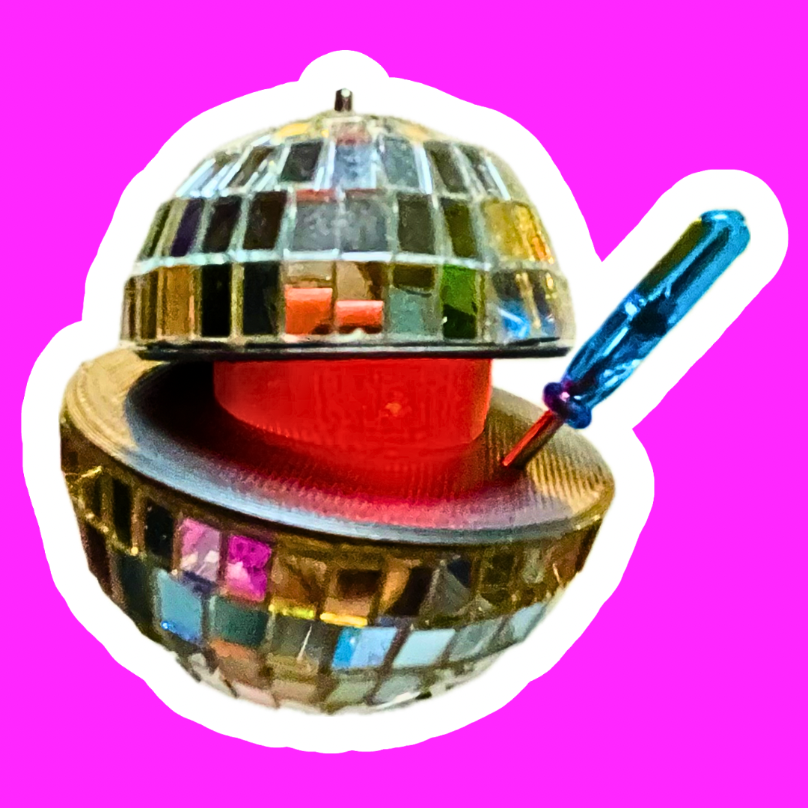

# Demon Core Disco Ball

`2025 Holiday Season - 3D Modeled Jewelery / Ornament`

<figure><figcaption></figcaption></figure>

## Concept

In 2025 memes of Anime girls playing with the demon core added to the many nilistic memes of the year alongside Oppenheimer releasing the year befor.  It was one of the things that got me to look into the history of the Manhattan Project experiments, including the deadly Demon Core experiment. Converting the two hemispheres to disco balls adds a diametric visual element that plays with the dicohotomy of doom and joy.

## Build

Mini disco balls are available from many sources online and I was able to get a set of many across 4 sizes from amazon for under $20. The two middle sizes seemed to be a good match to the visual ratio of the originals.

Two 3d prints hold the two halfs together printed in a gray / silver PETG - This could be one print, but I chose to do two so the innner faces have better surface finish.

A third print is done in clear PETG for holding the LED and a CR1220 coin cell (what I had around that fit)

The LED is a common self-cycling RGB that fades between colors

An earring finding can be added to make it jewelery and it is light enough to wear since the core of each hemisphere is styrofoam.

The screwdriver is a part that is commonly included with DIY kits

### Issues

Disco balls seem to be manufactured by spiraling mirrors around the styrofoam core - there seems to be an adhesive strip on the mirrors that is then linearly applied to the core in a spiral.

This is a problem when attempting to cut the balls in half as you'll end up with a stairstep at one point or a need to cut a few mirrors on a clean path.

I chose to remove all mirrors and replace them with 3mm phone screen tape (this is basically clear nano tape that is super thin) — luckily many of the mirrors came off in strips with it's original adhesive, tho that adhesive was no longer useful aside from keeping strips together

### DFM

While the original was meant as a gift for a maker Discord server I'm in, I do want to at some point make improvements for manufacturing.

Finding a source for the disco balls and seeing if they can make halfs with concentric strips of mirror tiles rather than spirals

The bracket print could be done in SLS in one print via a capable print farm

I would also like to improve the LED to include more via a custom flex circuit board - drift between the individual LED color cycling may introduce an interesting effect

## Files

Here is a link to my [OnShape project file](https://cad.onshape.com/documents/05fdd71f078fb37e21de4235/w/7805a55d3271d450f6227a3c/e/ee69cf224e7ea647d4dfc3ec?renderMode=0\&uiState=69727ccd4fc0e0945e22de76)

[Disco Balls on Amazon](https://amzn.to/49RW6SY)

[Mini Screwdrivers on Amazon](https://amzn.to/45mnc35)

