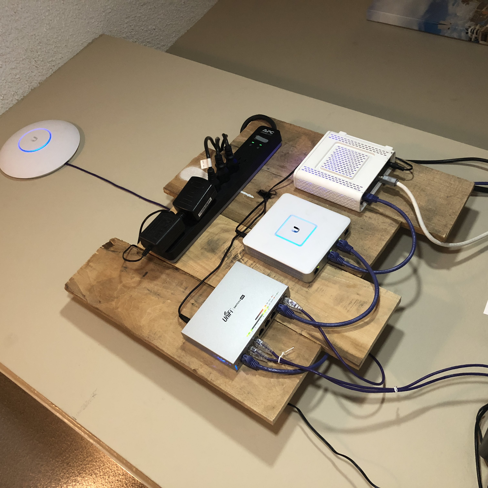

# Unifi Wall Mount

`2016/2017 - Functional Palette Art`

Meant for a small apartment with limited space where a standard OSB wall panel would have probably ended up in a closet. I think industrial design is nice to look at and this simple design elevated the visual and functional aspects in a handful of ways. Some of the status lights are actually useful so keeping them in view help you know if you need to interfere. Rebooting the system is made easy with the switch on the power strip, which feeds power bricks in the back. Held on the wall with a french cleat and two drywall screws.  Made 100% out of palette wood, wood glue, and screws on the balcony in about an hour or two.&#x20;

<figure><figcaption></figcaption></figure>
